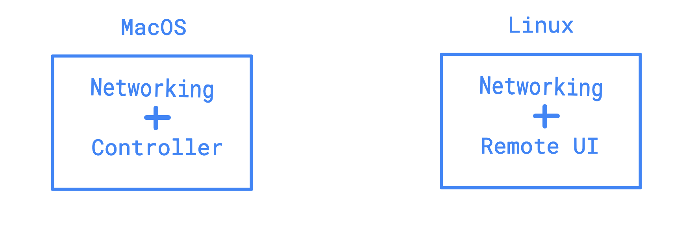
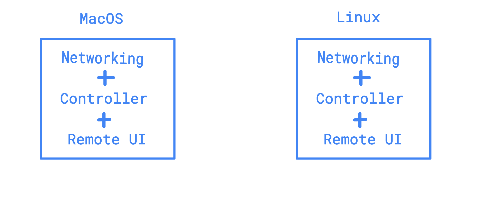
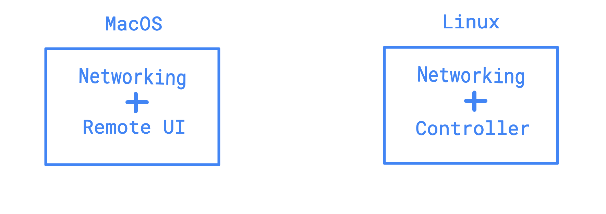
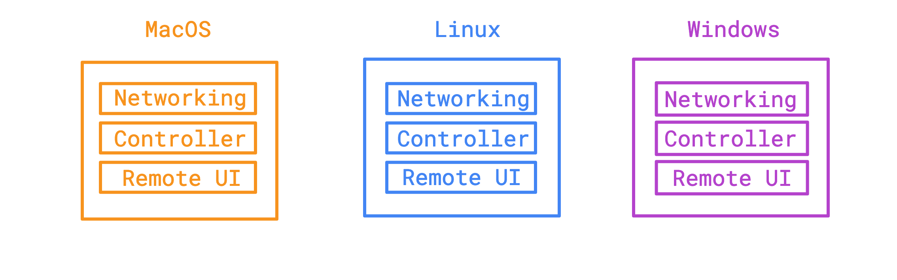
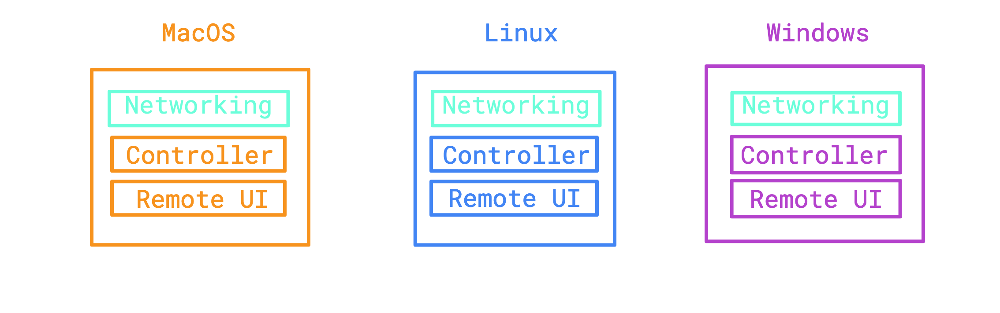
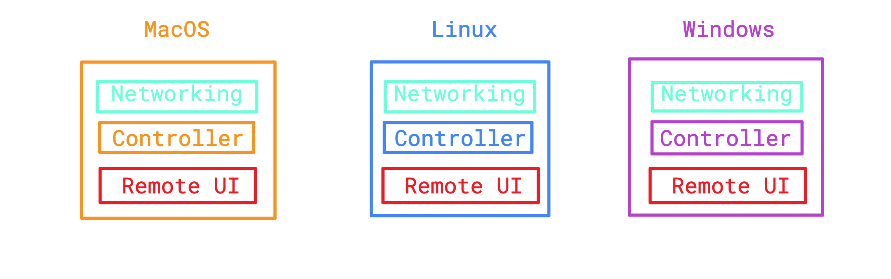
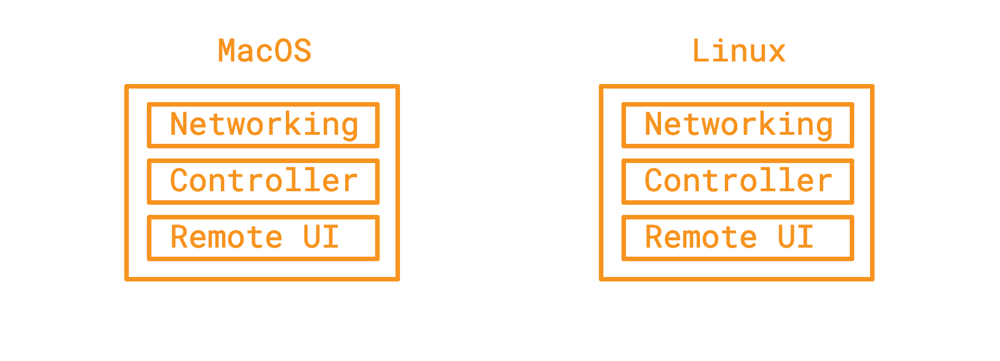
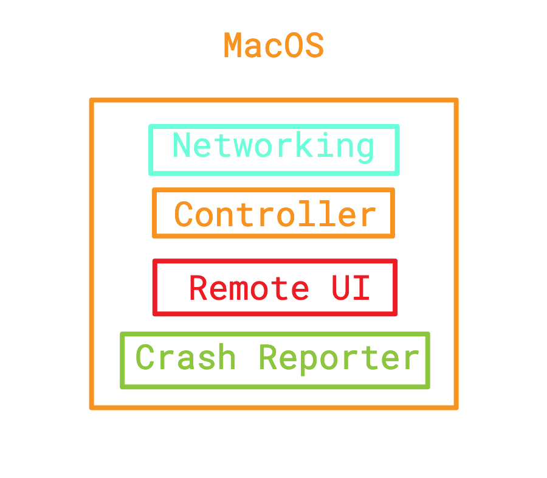

For remote mouse and keyboard control feature. One solution is this - 

Considering both the people are on MacOS. One person can access another person's
mouse and keyboard and control it. Both will install an app in their system,
and then exactly one person will be able to control the other person's mouse
and keyboard

How? MacOS has this feature of controlling mouse through code - they provide
APIs for this. Some links are here -

https://github.com/BlueM/cliclick

https://developer.apple.com/documentation/coregraphics/1455258-cgdisplaymovecursortopoint

Note: Need to add links to the learning log files that I wrote while trying
to build a demo app

Thoughts on architecture:

Let's see some diagrams of the architecture I have in my mind. Let's say I
have one MacOS user and a Linux OS user. Both are trying to do remote pairing.
Now what? Let's say Linux user wants to access the Mac user's laptop. How
would that look like? In terms of architecture, let's see the components we
would need

Now, after sometime, Mac user wants to control the Linux user's laptop. Now how
does that look like?

So, for any of the two users to be able to control the other laptop, they need
all the components that they could possibly need. So, each laptop will have
all these components

Let's talk about the terminologies in here now, to understand what each
component is about.

The boxes define software components. More like, a box represents a single
program or module may be?

**Networking Component** : Responsible for communication with the other user's
program, through the network. Let's limit the number of users to 1 for now, but
this component should be able to scale for connecting to more than one user
too later.

**Remote UI** : The interface that the user will use to control another user's
computer. For eg, currently Zoom draws the other user's screen in a window and
now when you place the mouse on the window and focus on it and click or type,
then it gets reflected on the other user's computer. Other examples could be -
show a virtual keyboard? where you click keys using the mouse. Or show a track
ball to control mouse? control it with keys may be? The last two examples might
help with testing only I guess, as they don't look like a great UI for the user
to control another computer.

**Controller Component** : It can control the mouse and keyboard of the
system that it's running on. I believe this component will be written in an
OS specific manner. But I'm not sure

# Development and Distribution of App and Testing

## Development and Architecture

Ideally I would want to one program, that works on all platforms, ie, a cross
platform application. And write the program in just one language. That way,
everything is simple. But that's not how it happens always 😅

**Controller**:

After checking out how to control the mouse on the MacOS, I'm guessing that the
controller component is going to be OS specific. But I'm not sure. I think I'll
have to do more spikes. For now I'm able to write a Swift program to do some
mouse controlling in MacOS. Have to check how to do the same in Linux and
Windows. And then look out for OS agnostic solutions - libraries, frameworks.
If it's going to be native, I'm guessing Windows may have C#. It just feels
like we can't write a program in one language and run everywhere - more like,
it feels like it's a OS level API or something? To access the mouse and keyboard.
I guess I'm already too biased, lol. I need to do that spike sooner. But if
OS agnostic is not present, not present yet that is, or is present and I didn't
find it 🙈, then we will have to write multiple programs for each platform -
Linux, MacOS and Windows. I haven't seen any programming language abstract such
stuff though - mouse and keyboar control, will check that too, apart from
libraries and frameworks for the same. If it's in a programming language and OS
agnostic, that's like heaven :P 

And the Controller component has 0 UI, like no graphical user interface that the
user can see. It just runs in the background and can control the mouse and
keyboard of the system that it's running on.

**Networking**:  
This is a common thing and is not OS specific. I mean, programming languages
have abstracted it well. So it does not have any possible issues like the
Controller has. We can write a separate program in one language and run it
everywhere - Linux, Mac, Windows. And then we need to see how to make it
communicate with the controller / remote UI. And this is a better architecture -
writing separate programs for controller and networking, instead of baking it
all into one program. And may be separate program for remote UI too. Because
if we try to write all as one program, ie one program doing everything -
networking, controller, remote UI, we will then have to write three programs,
one for each platform considering the fact that controller may be OS specific
so separate implementations. Downside to this one program for each platform,
doing everything is - we will be maintaing 3 versions of networking component
modules in the different programs written in different languages, which are
giving the same features. And since it's in different languages, they might
work differently too and have different bugs. It's just a nightmare actually.
More code, more things to develop and maintain. Not really needed.
Separate components is better. Also, the Networking component also has 0 UI,
it just runs silently in the background and does communications.

**Remote UI**: This is a UI component, with a window. We need to check if we can write
one program in one language for all platforms - cross-platform, along with
some good performance.

I mean, there are quite some solutions for cross platform desktop apps -

https://github.com/search?p=2&q=cross+platform+gui&type=Repositories&utf8=%E2%9C%93

https://github.com/search?p=2&q=cross+platform+gui+desktop&type=Repositories

Some are - [Electron](https://electronjs.org), [giu](https://github.com/AllenDang/giu)
which is based on [imgui](https://github.com/ocornut/imgui) and
[imgui-go](https://github.com/inkyblackness/imgui-go), [fyne](https://github.com/fyne-io/fyne),
[iced](https://github.com/hecrj/iced), [wxWidgets](https://github.com/wxWidgets/wxWidgets),
[Eto](https://github.com/picoe/Eto), [gowd](https://github.com/dtylman/gowd),
[muban](https://github.com/yue/muban), [yue](https://github.com/yue/yue),
[limn](https://github.com/christolliday/limn), [ui](https://github.com/vlang/ui),
[govcl](https://github.com/ying32/govcl), [rust-pushrod](https://github.com/KenSuenobu/rust-pushrod),
[Nuklear](https://github.com/Immediate-Mode-UI/Nuklear), [dwt](https://github.com/d-widget-toolkit/dwt),
[nodegui](https://github.com/nodegui/nodegui), [web-view](https://github.com/Boscop/web-view),
[wxphp](https://github.com/wxphp/wxphp), [msgbox-rs](https://github.com/bekker/msgbox-rs),
[Lgi](https://github.com/gale320/Lgi), [decrediton](https://github.com/decred/decrediton),
[dlangui](https://github.com/buggins/dlangui)

I've some experience with golang and javascript. And have some experience with
Electron. I might be biased to choose based on that. But then, I also want
to check performance and resource usage of the GUI app. I might even choose
rust, or just go full native if that's the best thing to do. But yeah, each
has it's own pros and cons. Usually I think - if we can do cross platform,
let's do that. Let's see. And the remote UI has these features - capture
mouse and keyboard events and then communicate with the networking component.

## Architecture diagrams

Some architecture diagrams based on the thought process above.

Different programs in different languages for all platforms and each one
consisting of all the components (Really crazy :P Won't choose it!):

Networking Component is going to be cross platform -

If remote UI is done cross platform too (which is possible! :D) then only
Controller will be platform specific -

Ideally I would expect fully cross platform but it could come with it's own cons
like possible performance issues? I don't know. I actually want the best of all
worlds :P  Performance, cross platform, everything :P This is how it will look
(windows too) -

## Coordination between components
Ideally the components will be interacting with other components when some
functionality of the other component is needed - that's my thought process.
This is more like micro services architecture but inside desktop apps among
components :P Anyways, I will have to think the cases about when and why one
component needs to access another component and define how that inter-component
communication will happen too - protocols and may be more (the unknown unknown).
Eg. Remote UI needs to get input from user and then communicate with
networking component in the system which will then communicate with the
networking component in the other user's system and then the networking
component in the other system will communicate with the controller component
to control the mouse / keyboard.

## Distribution

Now, if we develop one program, it's easy to distribute. Looks like we might
have multiple programs (components). Again, like microservices architecture.
Need to see how to wrap it all up and distribute it as one app, that can
probably orchestrate and run everything properly.

## Crash reporting

We will need some crash/issue reporting system for analysing issues in our app's
working. Ideally it should securely report crashes to some system of ours in the
Internet. This way we get to know about issues faster, rather than users raising
tickets and then us seeing them later. Sentry is one thing out there that's
open source and provides such an error reporting system :) 

https://sentry.io/

I'll also have to see how crash reporting systems usually work. I mean, what
if the whole app crashes? My code to send errors or anything to sentry may not
work? I have to see how to capture possible crashes and also see what crashes
cannot be captured. It all depends on the architecture, the code and all. 

Finally, with a crash reporter, I think the architecture will look like this -

## Security

The above does not include any thoughts or components regarding security.
Ideally every component must be built ground up with security in mind. Since
remote pairing tools getting hacked is the last thing you want - because then
someone can remotely access the computer and do stuff. That's like very scary.

## Discoverability

The above does not include how one user discovers the other user - like, they
know each other, yes, but how does one computer know the IP address of the
other computer so that they can start communicating P2P? or even if the
communications is through server, how does it all start? Ideally there should
be an authentication system - which helps solve the problem of "who are you in
this system?" for which the user logs in using their credentials and
identifies themselves, and then one user tells that they want to access another
user's computer by using the other user's identity. It's a big problem by
itself, which needs it's own solutioning. So, that will be discussed separely
under [solutions](./)
